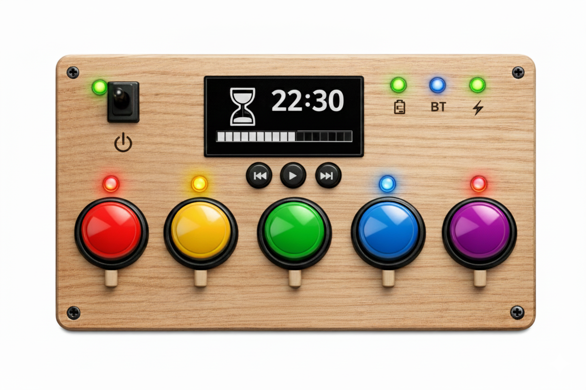

# Kids Music Panel Project

## Introduction

This project is a **DIY music panel for children** designed to allow kids to play music and audiobooks 
safely and interactively while providing parental controls.

The system consists of a **ESP32-based remote controll** with 
- an RFID reader to select the audio source
- an OLED display showing remaining playtime
- information LEDs
- and small control buttons (Prev / Start / Next) 

The playback is handled by **Home Assistant (HA) / Music Assistant (MA)**.
The streaming is handled by an **ESP32-based Squeezelight client** which streams the audio to **Bluetooth speakers**.

Parental controls enforce a **daily time limit** for audio playback
 and the panel provides intuitive visual feedback with LEDs.

---

## Architecture

### Overview

                   ┌───────────────────────────┐
                   │  ESP32 Remote Control     │
                   │ - Sends button events     │
                   │ - Receives remaining time │
                   └─────────▲─────────────────┘
                             │
                           Wi-Fi
                             │
                   ┌─────────▼────────────────┐
                   │  Home Assistant (HA/MA)  │
                   │ - Spotify integration    │
                   │ - Playtime tracking      │
                   │ - Parental controls      │
                   └──────────────────────────┘
                             │
                             │ Wi-Fi
                             ▼
                   ┌───────────────────────────┐
                   │  ESP32 Squeezelite Client │
                   │ - Attachs to MA as player │
                   │ - Bluetooth connection    │
                   └─────────▲─────────────────┘
                             │
                    Bluetooth│
                             ▼
                   ┌──────────────────────────┐
                   │    Bluetooth Speakers    │
                   └──────────────────────────┘

### Component Descriptions

- **ESP32 Remote Control:**
  User-facing frontend. Handles button input, LED feedback, OLED display.
  Sends button events to HA/MA and receives remaining time updates for display and LED control.
  Source files can be found in [remote-control](src/remote-control/).

- **Home Assistant (HA):**  
  Central brain of the system. 
  Receives button events, triggers audio playback to the bluetooth speakers over the ESP32 Squeezelite Client, enforces parental control limits, and updates remaining time for display on the panel.

- **ESP32 Squeezelite Client:**  
  Attachs to MA as a player. Connects to Bluetooth speakers for playback. Receives commands from HA.

- **Bluetooth Speakers:**  
  Bluetooth speakers for audio output. Playlists are streamed via Bluetooth.

---

## Shopping List Summary

### Electronics
- 1 ESP32 WROOM for the remote control 
- 1 ESP32 WROVER for the Squeezelite client
- 1 RFID module
- 3 small control buttons (Prev / Start/Stop / Next)  
- LEDs for each arcade button + resistors  
- Wires, headers, optional screw terminals  
- 0.96" monochrome OLED display (SPI)

### Mechanical / Wood
- Wooden board for panel
- Screws/nuts/washers  
- Drill + hole saw (24–30 mm)
- Engraving tool / woodburning pen  
- Sandpaper & varnish / polish  

### Miscellaneous
- Labeling tape / heat shrink for wires
- Multimeter for testing voltages  
