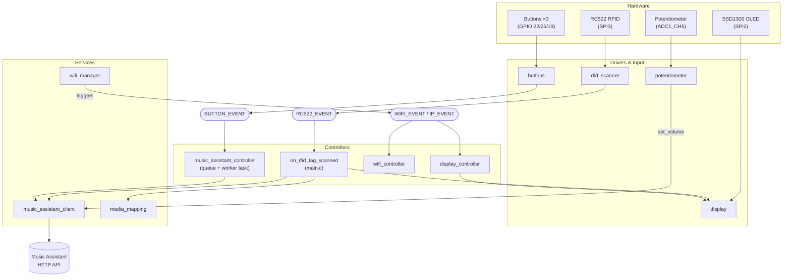
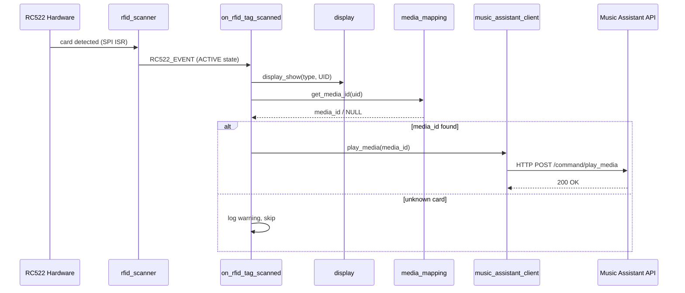
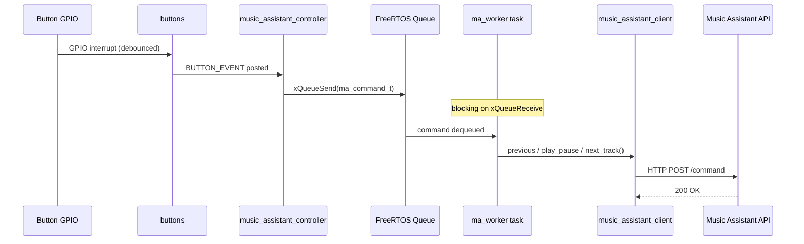
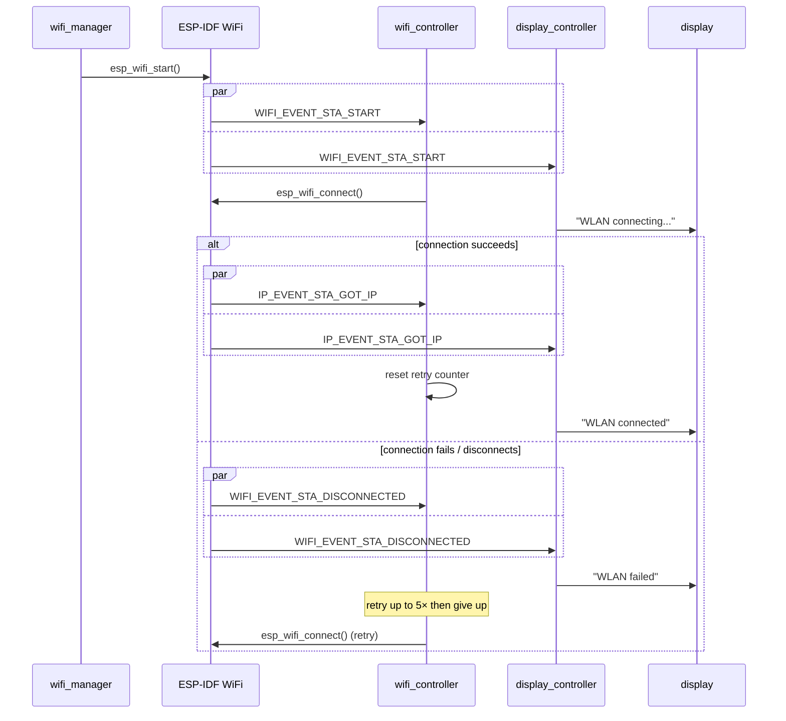
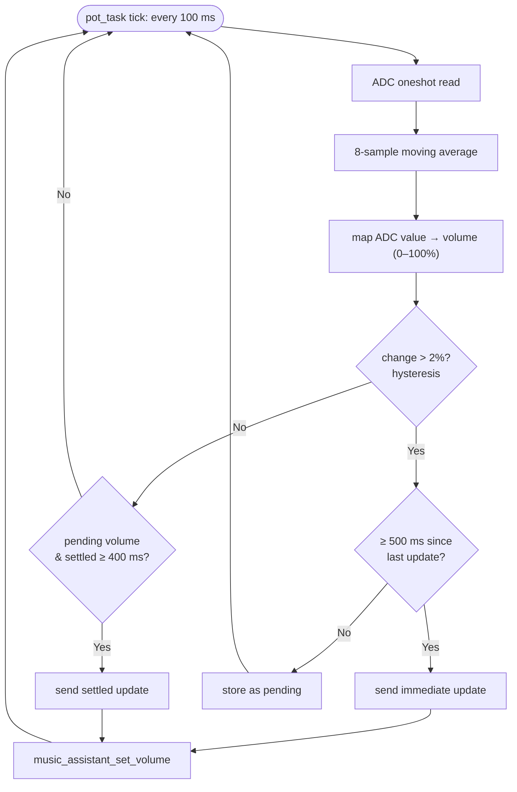

# Kids Music Panel - RFID Remote Control System
## Architecture & Implementation Specification

---

## 1. System Overview

The Kids Music Panel is an ESP32-based RFID card reader system that allows children to play music by scanning NFC/RFID cards. The system integrates with a Music Assistant API to control media playback.

### Key Features
- **RFID Card Scanning**: RC522-based reader on SPI3
- **Visual Feedback**: SSD1306 OLED display on SPI2
- **WiFi Connectivity**: Connects to Music Assistant service
- **Media Mapping**: UID-to-media-ID database
- **Event-Driven Architecture**: FreeRTOS task and event loop based
- **Physical Controls**: Prev/Play-Pause/Next buttons + potentiometer volume

---

## 2. Hardware Architecture

### 2.1 SPI Bus Configuration

#### SPI2 Host (OLED Display)
| Component | Pin | Purpose |
|-----------|-----|---------|
| MOSI | GPIO 23 | Data output to display |
| CLK | GPIO 18 | Clock signal |
| CS | GPIO 5 | Chip select |
| DC | GPIO 17 | Data/Command control |
| RST | GPIO 16 | Reset signal |

#### SPI3 Host (RFID Reader)
| Component | Pin | Purpose |
|-----------|-----|---------|
| MISO | GPIO 12 | Data input from reader |
| MOSI | GPIO 13 | Data output to reader |
| SCLK | GPIO 14 | Clock signal |
| CS/SDA | GPIO 15 | Chip select |
| RST | GPIO 27 | Reset signal |

### 2.2 Other Pins
| Component | Pin | Purpose |
|-----------|-----|---------|
| Button Prev | GPIO 22 | Previous track |
| Button Play/Pause | GPIO 25 | Play/pause toggle |
| Button Next | GPIO 19 | Next track |
| Potentiometer | GPIO 33 (ADC1_CH5) | Volume control |
| Soft Power | GPIO 21 | Hardware power-off latch |

All pin definitions live in `common/board_pins.h`.

### 2.3 Component List
- **MCU**: ESP32 WROOM
- **OLED**: SSD1306 (128x64, SPI)
- **RFID Reader**: RC522 (SPI)
- **Buttons**: 3× GPIO (debounced via ISR)
- **Potentiometer**: B10K linear, read via ADC1
- **WiFi**: Built-in ESP32 WiFi module

---

## 3. Software Architecture

### 3.0 Component Diagram



---

### 3.1 Module Structure

All modules live under `main/` as subdirectories. Each module owns its own event base where applicable; `app_events.h` is reserved for cross-cutting events only.

#### `common/`
- **`config.h`** — application-wide timing constants, display message strings, device/entity IDs
- **`board_pins.h`** — all GPIO and SPI pin definitions
- **`app_events.h/c`** — `APP_EVENTS` event base for cross-cutting events (WiFi state, parental limit, BLE, errors)

#### `display/`
- **`display.c/h`** — SSD1306 driver init and `display_show()` primitive
- **`display_controller.c/h`** — subscribes to `WIFI_EVENT`/`IP_EVENT`; maps WiFi state changes to display text

#### `rfid/`
- **`rfid_scanner.c/h`** — RC522 init on SPI3; `rfid_scanner_start()` registers the card-state-change callback

#### `music_assistant/`
- **`music_assistant_client.c/h`** — HTTP client; all MA API calls (see §3.3)
- **`music_assistant_controller.c/h`** — subscribes to `BUTTON_EVENT`; enqueues commands into a FreeRTOS queue; worker task executes them via the client

#### `wifi/`
- **`wifi_manager.c/h`** — WiFi init, STA mode start
- **`wifi_controller.c/h`** — subscribes to `WIFI_EVENT`/`IP_EVENT`; manages retry counter and reconnection

#### `input/`
- **`buttons.c/h`** — GPIO ISR debounce for 3 buttons; publishes on `BUTTON_EVENT` event base (`BUTTON_EVENT_ID_PREVIOUS_TRACK_PRESSED`, `BUTTON_EVENT_ID_PLAY_PAUSE_PRESSED`, `BUTTON_EVENT_ID_NEXT_TRACK_PRESSED`)
- **`potentiometer.c/h`** — FreeRTOS task polling ADC1_CH5 every 100 ms; applies 8-sample moving average, 2% hysteresis, 500 ms rate limit, 400 ms settling detection; calls `music_assistant_set_volume()` directly

#### `soft_power/`
- **`soft_power.c/h`** — controls GPIO-21 power latch; `soft_power_shutdown()` cuts board power

#### `media_mapping.c/h`
Static lookup table mapping RFID UID strings (`"AA BB CC DD"`) to Music Assistant media URIs. Add new cards here.

#### `main.c`
Thin entry point: initialises NVS, default event loop, netif, then calls each module's `_init()` in order. The `on_rfid_tag_scanned` callback (RFID → display + MA play) is still defined here pending a future move to `rfid_scanner.c` or a dedicated handler.

---

### 3.2 Event Buses

| Event Base | Owner | Events |
|---|---|---|
| `WIFI_EVENT` / `IP_EVENT` | ESP-IDF | WiFi and IP lifecycle (used by `wifi_controller`, `display_controller`) |
| `BUTTON_EVENT` | `input/buttons.h` | `PREVIOUS_TRACK_PRESSED`, `PLAY_PAUSE_PRESSED`, `NEXT_TRACK_PRESSED` |
| `RC522_EVENT` | rc522 library | Card state changes (ACTIVE/IDLE) |
| `APP_EVENTS` | `common/app_events.h` | Cross-cutting: WiFi status, parental limit, BLE, errors (reserved for future use) |

Module-specific event bases are kept separate; `APP_EVENTS` is only for events that span multiple subsystems.

---

### 3.3 Music Assistant Client API

```c
esp_err_t music_assistant_client_init(void);
esp_err_t music_assistant_play_media(const char *media_id);
esp_err_t music_assistant_previous_track(void);
esp_err_t music_assistant_play_pause(void);
esp_err_t music_assistant_next_track(void);
esp_err_t music_assistant_set_volume(int volume_level);   // 0–100
esp_err_t music_assistant_volume_up(void);
esp_err_t music_assistant_volume_down(void);
esp_err_t music_assistant_seek_forward(int seconds);
esp_err_t music_assistant_seek_backward(int seconds);
esp_err_t music_assistant_get_media_position(float *position);
esp_err_t music_assistant_seek_to_position(float position);
```

---

### 3.4 Event Flows

**RFID card scan → playback**



**Button press → MA command**



**WiFi connect → display**



**Potentiometer → volume** (polling loop)



---

### 3.5 Data Structures

```c
// Media mapping entry (media_mapping.c)
typedef struct {
    const char *uid_string;   // e.g. "B9 83 53 97"
    const char *media_id;     // e.g. "radiobrowser://radio/..."
} uid_media_entry_t;

// Music Assistant command (music_assistant_controller.c)
typedef struct {
    ma_command_type_t type;   // PREVIOUS_TRACK | PLAY_PAUSE | NEXT_TRACK | PLAY_MEDIA
    union {
        char media_id[128];   // populated for PLAY_MEDIA
    };
} ma_command_t;

// Button event data (input/buttons.h)
typedef struct {
    int pin;
    buttons_event_id_t button_id;
} buttons_event_data_t;
```

---

## 4. Implementation Roadmap

### Phase 1: Modularization ✅ Complete
- [x] Extract WiFi logic → `wifi/wifi_manager.c`
- [x] Extract Display logic → `display/display.c`
- [x] Extract RFID logic → `rfid/rfid_scanner.c`
- [x] Extract HTTP logic → `music_assistant/music_assistant_client.c`
- [x] Implement `media_mapping.c`
- [x] Create `common/config.h` and `common/board_pins.h`

### Phase 2: Async Command Queues (Partially done)
- [x] MA controller uses FreeRTOS command queue + worker task (`ma_worker`)
- [ ] Display updates via message queue (currently direct `display_show()` calls)
- [ ] RFID event handling moved out of `main.c`

### Phase 3: Error Handling & Resilience
- [ ] HTTP timeout and retry handling
- [ ] WiFi reconnection with exponential back-off
- [ ] Display error codes for failed API calls

### Phase 4: NVS Storage
- [ ] Migrate media mappings to NVS
- [ ] Support runtime mapping updates without recompile

### Phase 5: JSON Configuration
- [ ] JSON config file via SPIFFS or LittleFS
- [ ] Web-based mapping editor

---

## 5. Code Organization

```
src/remote-control/
└── main/
    ├── main.c                    # Entry point; on_rfid_tag_scanned callback (TODO: move)
    ├── media_mapping.c/h         # Static UID→media URI table
    ├── CMakeLists.txt
    ├── Kconfig.projbuild         # menuconfig: WiFi SSID/password, MA host/API key
    ├── idf_component.yml         # Component deps: rc522 ^3.4.3, ssd1306 ^1.1.2
    ├── common/
    │   ├── config.h              # Timing constants, display strings, device/entity IDs
    │   ├── board_pins.h          # All GPIO and SPI pin definitions
    │   └── app_events.h/c        # APP_EVENTS base (cross-cutting events)
    ├── display/
    │   ├── display.c/h           # SSD1306 driver + display_show()
    │   └── display_controller.c/h # WiFi events → display text
    ├── rfid/
    │   └── rfid_scanner.c/h      # RC522 init + event registration
    ├── music_assistant/
    │   ├── music_assistant_client.c/h     # HTTP API client
    │   └── music_assistant_controller.c/h # Button events → command queue → client
    ├── wifi/
    │   ├── wifi_manager.c/h      # WiFi STA init
    │   └── wifi_controller.c/h   # Retry logic, reconnection
    ├── input/
    │   ├── buttons.c/h           # GPIO ISR + BUTTON_EVENT publishing
    │   └── potentiometer.c/h     # ADC polling task + smoothing → set_volume()
    └── soft_power/
        └── soft_power.c/h        # GPIO-21 power latch
```

---

## 6. Configuration (menuconfig)

Required `idf.py menuconfig` entries:

| Key | Description |
|-----|-------------|
| `WIFI_SSID` | WiFi network name |
| `WIFI_PASSWORD` | WiFi password |
| `MUSIC_ASSISTANT_HOST` | MA API base URL (e.g. `http://192.168.x.x:8000`) |
| `MUSIC_ASSISTANT_API_KEY` | Bearer token |

Static constants (not via menuconfig) in `common/config.h`:
- `CONFIG_DEVICE_ID` — unique device identifier
- `CONFIG_MEDIA_PLAYER_ENTITY_ID` — Home Assistant entity name for the Squeezelite player

---

## 7. Dependencies

- **FreeRTOS**: task creation, queues, timers
- **ESP-IDF**: WiFi, NVS, HTTP client, ADC, GPIO, logging
- **abobija/rc522 ^3.4.3**: RC522 RFID driver
- **chill-sam/ssd1306 ^1.1.2**: SSD1306 OLED driver
- **cJSON** (future, Phase 5): JSON config parsing

---

## 8. Performance Targets

| Metric | Target |
|--------|--------|
| Card detection latency | < 1 s |
| HTTP request timeout | 5 s |
| Display update latency | < 100 ms |
| WiFi reconnection time | < 10 s |
| Potentiometer update rate | 500 ms min interval |
